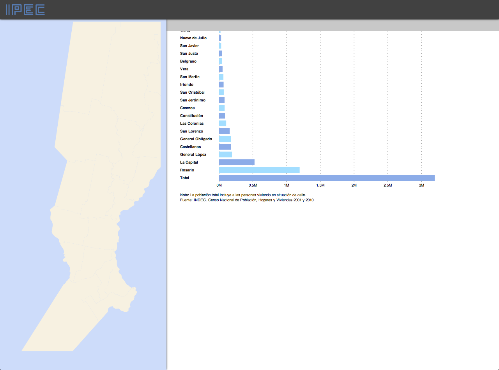
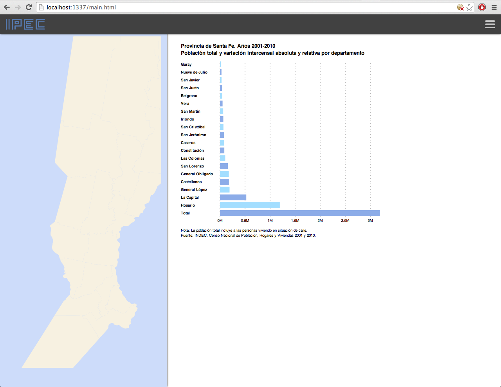

Visualización Interactiva de Datos
----------------------------------

### IPEC — Instituto Provincial de Estadística y Censos
Santa Fe, La Capital 2014

#### Presentación
El presente proyecto es una iniciativa del departamento de informática con objetivo de atualizar las herramientas digitales para publicación y visualización de datos estadísticos de la província.

Actualmente trabajamos las visualizaciones en caracter experimental. Con una mirada hacia el futuro, utilizamos software en version beta y especificaciones con implelmentación en andamento.

#### Biblioteca
[PostgreSQL](http://www.postgresql.org/), [Postgis](http://postgis.net/), [Git](http://git-scm.com/), [JavaScript](https://developer.mozilla.org/en-US/docs/Web/JavaScript), [Google Fonts](http://www.google.com/fonts), [Font Awesome](http://fortawesome.github.io/Font-Awesome/), [Backbone](http://backbonejs.org/), [Underscore](http://underscorejs.org/), [jQuery](http://jquery.com/), [D3](http://d3js.org/), [Node](http://nodejs.org/), [node-postgres](https://github.com/brianc/node-postgres/), [node-uuid](https://github.com/broofa/node-uuid/), [HTML](http://www.w3.org/html/wg/drafts/html/master/), [CSS](http://www.w3.org/TR/css-2010/), [JSON](http://json.org/), [GeoJSON](http://geojson.org/), [JSON-js](https://github.com/douglascrockford/JSON-js), [TopoJSON](http://github.com/mbostock/topojson), [CDNJS](http://cdnjs.com/), [Mapshaper](https://github.com/mbloch/mapshaper). 

#### Contribuya
Cloná el repositório.

	$ git clone https://github.com/n370/santafe_datavis

Cargá un servidor HTTP para los archivos estáticos.

	$ cd santafe_datavis
	$ npm start

Visitá [http://localhost:1337/main.html](http://localhost:1337/main.html) en tu navegador.

#### Screenshots

