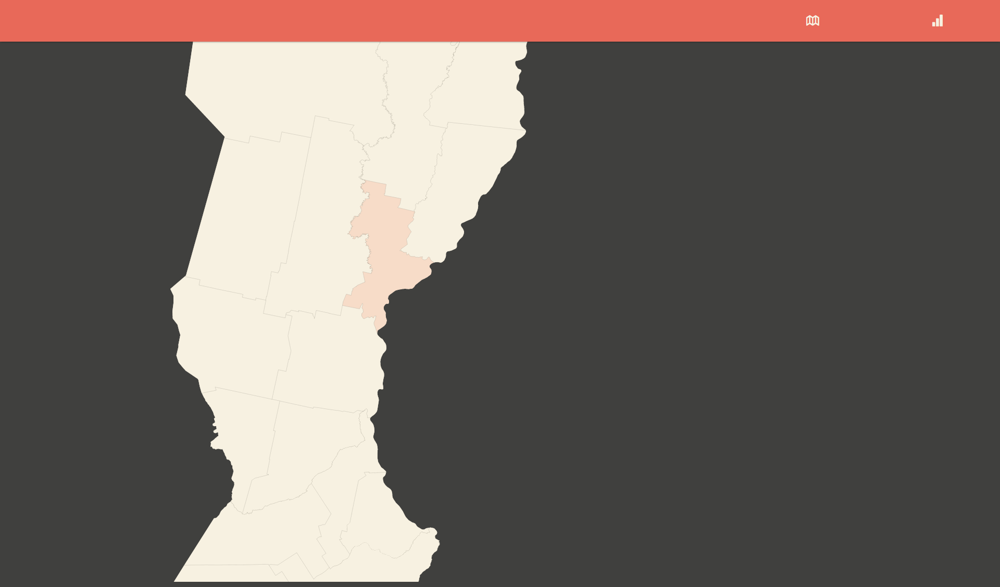

Visualización Interactiva de Datos
----------------------------------

### IPEC — Instituto Provincial de Estadística y Censos
Santa Fe, La Capital 2014

#### Presentación
El presente proyecto es una iniciativa del departamento de informática con objetivo de atualizar las herramientas digitales para publicación y visualización de datos estadísticos de la província.

Actualmente trabajamos las visualizaciones en caracter experimental. Con una mirada hacia el futuro, utilizamos software en version beta y especificaciones con implelmentación en andamento.

#### Recursos
[Python](http://www.python.org/)  
[Git](http://git-scm.com/)  
[JavaScript](https://developer.mozilla.org/en-US/docs/Web/JavaScript)  
[Google Fonts](http://www.google.com/fonts)  
[Icon Fonts](http://weloveiconfonts.com/)  
[Angular](http://angularjs.org/)  
[D3](http://d3js.org/)  
[Open Layers 3](http://ol3js.org/)  
[Polymaps](http://polymaps.org/)  
[Node](http://nodejs.org/)    
[HTML5](http://developer.mozilla.org/en-US/docs/Web/Guide/HTML/HTML5)  
[CSS3](http://developer.mozilla.org/en-US/docs/Web/CSS/CSS3)  
[JSON](http://json.org/), [GeoJSON](http://geojson.org/) y [TopoJSON](http://github.com/mbostock/topojson)  
[CDNJS](http://cdnjs.com/)

#### Contribuya
Cloná el repositório.

	$ git clone https://github.com/n370/santafe-datavis

Cargá un servidor HTTP para los archivos estáticos.

	$ cd santafe-datavis
	$ python -m SimpleHTTPServer 1337

Visitá [http://127.0.0.1:1337/public/index.html](http://127.0.0.1:1337/public/index.html) en tu navegador.

#### Screenshots

